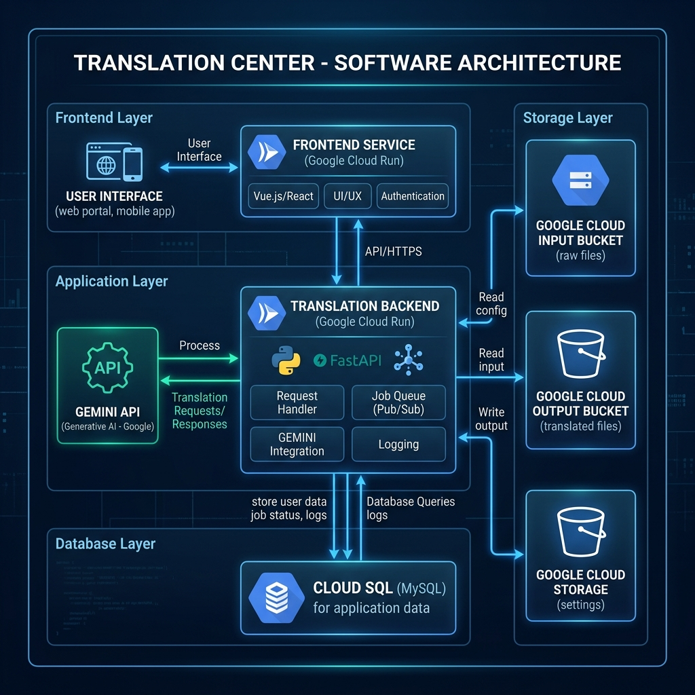

# Translation Center - Enterprise Document Translator

Translation Center is a microservices-based translation management system. It enables teams to upload documents (PDFs and Google Docs) from local machines or import them directly via Google Drive links. The system translates the document content using either the **Gemini model API** + PDF manipulation, or the **Cloud Translation API** service. 

After translation, the document goes through an approval workflow where reviewers can approve or reject the candidates.

Created with Antigravity and Gemini 3.5 Flash.
Use at you own risk.

## System Architecture



### Key Architectural Flow
1. **Frontend Service (React + Express)** handles authentication (using a local file `users.json` storing roles and hashed passwords) and hosts the main application UI and Admin dashboard.
2. **Database Layer (Cloud SQL MySQL)** stores job data, logs, and token usage metrics.
3. **Storage Layer (Google Cloud Storage)** uses three buckets: `translation_input_files` for source files, `translation_output_files` for translation candidate and final output documents, and `translation_config` for configs (`translation_config.md`), prompts (`translation_prompt.md`), corpus, and DNT terms list.
4. **Translation Backend Service (Python FastAPI)** listens for triggers, fetches the document, extracts block layout items, calls Gemini model API to translate layout content, and overlays translated texts back onto the original layout coordinates to preserve formatting.

## Deploy instructions

Clone this repo to your machine our cloud shell and use terraform to deploy to GCP.

Enable the following APIs for the project:
  - Cloud Resource Manager API 
  - Identity and Access Management (IAM) API
  - Cloud Translation API (if you want to use this option)

```bash
cd terraform
terraform init
terraform apply -var="project_id=CHANGE_ME" -var="db_password=..." -var="jwt_secret=YOUR_SECURE_PRODUCTION_JWT_SECRET"
-var="deployer_email=name@yourdomain.com"
```
Services will be deployed in 2 Cloud Run instances + SQL database + 3 Storage Buckets.
A service account will be created to run the services and call the Gemini API.
This account will also access the Google Drive files.

---

## Directory Structure

- [database/](file:///Users/jamarmu/Workdir/Antigravity/TranslationCenter/database): Contains MySQL schema scripts.
  - [database/README.md](file:///Users/jamarmu/Workdir/Antigravity/TranslationCenter/database/README.md): Documentation on MySQL schema structure and queries.
  - [database/schema.sql](file:///Users/jamarmu/Workdir/Antigravity/TranslationCenter/database/schema.sql): Database initialization script for tables (jobs, usage_logs, app_logs).
- [frontend/](file:///Users/jamarmu/Workdir/Antigravity/TranslationCenter/frontend): Codebase for Express API gateway and Vite React SPA application.
  - [frontend/README.md](file:///Users/jamarmu/Workdir/Antigravity/TranslationCenter/frontend/README.md): Detail on environment configuration and script commands.
  - [frontend/package.json](file:///Users/jamarmu/Workdir/Antigravity/TranslationCenter/frontend/package.json): Frontend application dependency settings.
  - [frontend/vite.config.js](file:///Users/jamarmu/Workdir/Antigravity/TranslationCenter/frontend/vite.config.js): Build configurations for the React single-page application.
  - [frontend/index.html](file:///Users/jamarmu/Workdir/Antigravity/TranslationCenter/frontend/index.html): HTML page mount.
  - [frontend/server.js](file:///Users/jamarmu/Workdir/Antigravity/TranslationCenter/frontend/server.js): Express gateway server coordinating API requests, sessions, database updates, and GCS proxying.
  - [frontend/users.json](file:///Users/jamarmu/Workdir/Antigravity/TranslationCenter/frontend/users.json): Configured usernames, roles, and hashed passwords.
  - [frontend/Dockerfile](file:///Users/jamarmu/Workdir/Antigravity/TranslationCenter/frontend/Dockerfile): Container build instructions for frontend service.
  - [frontend/src/](file:///Users/jamarmu/Workdir/Antigravity/TranslationCenter/frontend/src): React component folder.
    - [frontend/src/App.jsx](file:///Users/jamarmu/Workdir/Antigravity/TranslationCenter/frontend/src/App.jsx): Core React dashboard UI handling document uploads, translations review, status, and analytics.
    - [frontend/src/index.css](file:///Users/jamarmu/Workdir/Antigravity/TranslationCenter/frontend/src/index.css): Styling themes, transitions, grid setups, and custom components.
    - [frontend/src/main.jsx](file:///Users/jamarmu/Workdir/Antigravity/TranslationCenter/frontend/src/main.jsx): React runtime entry script.
- [backend/](file:///Users/jamarmu/Workdir/Antigravity/TranslationCenter/backend): Python FastAPI translation service.
  - [backend/README.md](file:///Users/jamarmu/Workdir/Antigravity/TranslationCenter/backend/README.md): Details on Python translation pipelines and Gemini block rendering.
  - [backend/requirements.txt](file:///Users/jamarmu/Workdir/Antigravity/TranslationCenter/backend/requirements.txt): Python dependency lists.
  - [backend/Dockerfile](file:///Users/jamarmu/Workdir/Antigravity/TranslationCenter/backend/Dockerfile): Container deployment configuration for the translation worker.
  - [backend/main.py](file:///Users/jamarmu/Workdir/Antigravity/TranslationCenter/backend/main.py): FastAPI app router entry hosting /translate webhook calls.
  - [backend/translator.py](file:///Users/jamarmu/Workdir/Antigravity/TranslationCenter/backend/translator.py): Layout block parser, Gemini client, and PDF overlay generator.
  - [backend/db.py](file:///Users/jamarmu/Workdir/Antigravity/TranslationCenter/backend/db.py): MySQL database adapter helper routines.
- [terraform/](file:///Users/jamarmu/Workdir/Antigravity/TranslationCenter/terraform): Google Cloud Platform Terraform deployment configurations.
  - [terraform/README.md](file:///Users/jamarmu/Workdir/Antigravity/TranslationCenter/terraform/README.md): Detailed infrastructure provisioning deployment guide.
  - [terraform/main.tf](file:///Users/jamarmu/Workdir/Antigravity/TranslationCenter/terraform/main.tf): Resource declarations (Cloud SQL, Cloud Run, GCS Buckets, and service integrations).
  - [terraform/variables.tf](file:///Users/jamarmu/Workdir/Antigravity/TranslationCenter/terraform/variables.tf): Variable declarations (project IDs, regions, secrets).
  - [terraform/outputs.tf](file:///Users/jamarmu/Workdir/Antigravity/TranslationCenter/terraform/outputs.tf): Resource values printed upon completion.
- [config_init/](file:///Users/jamarmu/Workdir/Antigravity/TranslationCenter/config_init): Preset parameters to configure default translation profiles.
  - [config_init/translation_prompt.md](file:///Users/jamarmu/Workdir/Antigravity/TranslationCenter/config_init/translation_prompt.md): System prompt guidelines instructing the model.
  - [config_init/translation_corpus.csv](file:///Users/jamarmu/Workdir/Antigravity/TranslationCenter/config_init/translation_corpus.csv): Pre-approved terms list.
  - [config_init/do_not_translate.csv](file:///Users/jamarmu/Workdir/Antigravity/TranslationCenter/config_init/do_not_translate.csv): Words/acronyms to bypass translation.
  - [config_init/translation_config.md](file:///Users/jamarmu/Workdir/Antigravity/TranslationCenter/config_init/translation_config.md): Default setup configuration parameters.
- [architecture.png](file:///Users/jamarmu/Workdir/Antigravity/TranslationCenter/architecture.png): Architecture flow design graphic.
